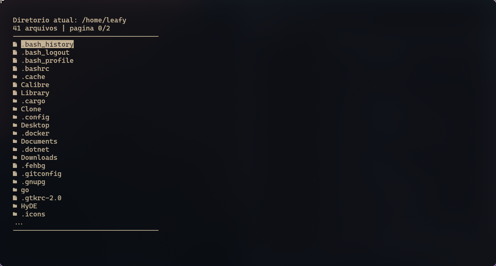

# lsa
Alternativa para o ls com uma TUI criada apenas com bash

--

Com foco em algo simples mas funcional e util, o lsa veio
par facilitar a visualização de arquivos e diretórios, bem
como a navegação entre eles. Com uma interface simples e amigavel.



A navegação é feita com as setas do teclado, e temos os seguintes atalhos::

## Atalhos

- **a**: caso usado em cima de uma pasta, ele entra nela,
caso usado em cima de um arquivo, ele abre o arquivo com o editor padrão; (enter tambem funciona)

- **s**: volta um diretório;

- **d**: abre o diretório atual no editor de texto;

- **f**: renomear o arquivo ou diretório selecionado;

- **q**: sai do lsa;

- **/**: aplicar filtro no diretorio atual;

- **esq**: recarega o diretorio atual, limpando o filtro;

- **cima/baixo**: navega entre os arquivos e pastas;

- **esquerda/direita**: navega entre paginas (z - x tambem funcionam);

- **r**: remove o arquivo ou diretório selecionado;

- **.**: cria um arquivo (ou diretorio se comecar com /);

- **h**: abre o menu de ajuda;

## configuração

A configuração do lsa pode ser feita no proprio arquivo,
onde é possivel alterar o editor de texto (zed por padrao) e a
qunatidade de arquivos exibidos por pagina (por padrao 20);

```bash
editor='zed'
max_per_page=20
```

## Instalação

Para instalar o lsa, basta clonar o repositório e rodar o script
`install.sh`. Ele irá copiar o script para o diretorio
`/usr/local/bin` para tornar o comando lsa global.

```bash
git clone https://github.com/Ieafyy/lsa.git && cd lsa && chmod +x install.sh && ./install.sh
```
